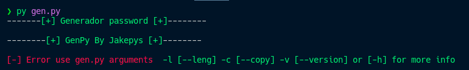

# PyssWord 🕵️‍♂️
Un generador de password simple pero eficiente, sobre todo si utilizas keepass como gestor de password. Pasando como argumento la longitud de la contrasena a crear.
Apesar que que ya hay herramientas que crean contrasenas por defecto, este simple script lo hace de manera rapida y en la termianal. 


# Usar binario
```sh
# Linux, Unix
chmod +x bin/genpy

#Ejecurar
./genpy


# Para usarlo como comando de sistema
sudo mv bin/genpy /usr/bin/

# Luego podremos llamarlo
genpy
```
# Instalar en local y probar codigo
```sh
# Istalar lo requerimientos
pip3 install -r requirements.txt

# Para ejecutar el archivo 
python3 gen.py

# Compilar
pyinstaller --noconfirm --onefile --console --name "nameYourBin" --add-data "$('pwd')/generador-password/modules:modules/"  "$('pwd')/generador-password/"

# Si no compila escribe
auto-pip-to-exe
# Esto abrira un localhost con opciones graficas para compilar
```

## Ejemplo



- **Como minimo la longitud tiene que ser de 8**
- **Copia la contraseña en la clipboard (Porta papeles)**
- **Es GPLv3, puede ser modificado y repartido libremente**
- **Esta en beta, posibles bugs!**
## **About me** **🌌**

```html
Mi nombre es juan. pero me dicen jakepys. Soy un programador autodidacta enamorado de el código y todo lo relacionado con linux, me encanta crear cositas y a pesar que son diminutas me ayuda aprender cada dia mas. Menester aclarar que me encanta Python, pero me encuentro aprendiendo JavaScript 💛. Así que cualquier duda o pregunta acerca de mí, puedes escribirme. 
<script>
   const aboutMe = {
      email: "j4kyjak3@protonmail.com",
   }
</script>
```

*No hay mejor cosas que aprender y darte cuenta que no sabes y nunca parar de hacerlo.  - Jpys*
