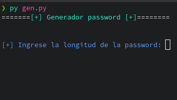

# PyssWord 🕵️‍♂️
Un generador de password simple pero eficiente, sobre todo si utilizas keepass como gestor de password. Pasando como argumento la longitud de la contrasena a crear.
Apesar que que ya hay herramientas que crean contrasenas por defecto, este simple script lo hace de manera rapida y en la termianal. 

# Usar ⌨️
```sh
# Linux, Mac Y Windows
python3 gen.py
```
# Ejemplo



- **Como minimo la longitud tiene que ser de 8**
- **No depende de modulos de terceros. (No hay que descargar nada)**
- **Es GPLv3, puede ser modificado y repartido libremente**

## **About me** **🌌**

```html
Mi nombre es juan. pero me dicen jakepys. Soy un programador autodidacta enamorado de el código y todo lo relacionado con linux, me encanta crear cositas y a pesar que son diminutas me ayuda aprender cada dia mas. Menester aclarar que me encanta Python, pero me encuentro aprendiendo JavaScript 💛. Así que cualquier duda o pregunta acerca de mí, puedes escribirme. 
<script>
   const aboutMe = {
      email: "j4kyjak3@protonmail.com",
   }
</script>
```

*No hay mejor cosas que aprender y darte cuenta que no sabes y nunca parar de hacerlo.  - Jpys*
